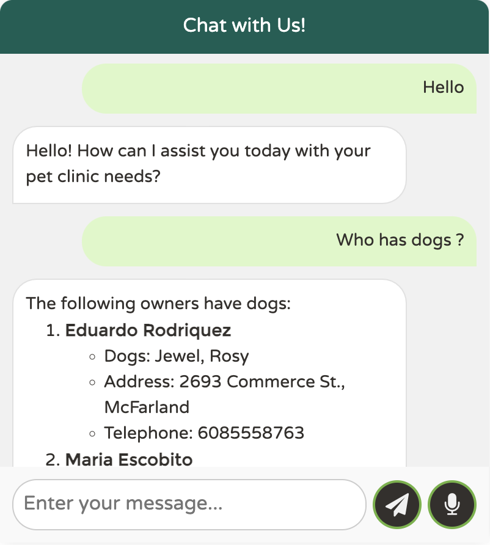

# LangChain4j로 빌드된 GenAI Spring PetClinic 샘플 애플리케이션 [](https://github.com/spring-petclinic/spring-petclinic-langchain4j/actions/workflows/maven-build.yml)[](https://github.com/spring-petclinic/spring-petclinic-langchain4j/actions/workflows/gradle-build.yml)

[](https://gitpod.io/#https://github.com/spring-petclinic/spring-petclinic-langchain4j) [](https://github.com/codespaces/new?hide_repo_select=true&ref=main&repo=https://github.com/codespaces/new?hide_repo_select=true&ref=main&repo=875544168)

# LangChain4j로 빌드된 GenAI Spring PetClinic 샘플 애플리케이션 [](https://github.com/spring-petclinic/spring-petclinic-langchain4j/actions/workflows/maven-build.yml)[](https://github.com/spring-petclinic/spring-petclinic-langchain4j/actions/workflows/gradle-build.yml)

[](https://gitpod.io/#https://github.com/spring-petclinic/spring-petclinic-langchain4j) [](https://github.com/codespaces/new?hide_repo_select=true&ref=main&repo=https://github.com/codespaces/new?hide_repo_select=true&ref=main&repo=875544168)

## Spring Petclinic LangChain4j 애플리케이션 이해하기

유명한 Spring Petclinic 애플리케이션에 **생성형 AI**를 사용하는 챗봇이 추가되었습니다.
이 버전은 **[LangChain4j 프로젝트](https://docs.langchain4j.dev/)**를 사용하며 현재 **OpenAI** 또는 **Azure의 OpenAI** 또는 **Ollama**(부분 지원)를 **LLM 공급자**로 지원합니다.
이것은 Spring AI 기반의 **[spring-petclinic-ai](https://github.com/spring-petclinic/spring-petclinic-ai)**에서 포크된 것입니다.

이 샘플은 **LangChain4j를 사용하여 Java 애플리케이션에 AI/LLM 기능을 쉽게 통합하는 방법**을 보여줍니다.
이는 다음을 통해 달성할 수 있습니다:
* LLM 또는 임베딩 공급자와 같은 특정 구현에서 코드를 분리하도록 설계된 통합된 **추상화 계층**으로, 구성 요소 교체를 쉽게 할 수 있습니다.
  [application.properties](src/main/resources/application.properties) 파일만 OpenAI 또는 Azure OpenAI와 같은 LLM 공급자를 참조합니다.
* **메모리**는 현재 및 이전 대화 모두에 대해 LLM에 컨텍스트를 제공하며, 여러 사용자를 지원합니다.
  [AssistantConfiguration](src/main/java/org/springframework/samples/petclinic/chat/AssistantConfiguration.java)에서 `MessageWindowChatMemory` 클래스 사용 및
  [Assistant](src/main/java/org/springframework/samples/petclinic/chat/Assistant.java) 인터페이스의 `@MemoryId` 어노테이션을 참조하십시오.
* **AI 서비스**는 간단한 Java API를 통해 복잡한 AI 동작을 선언적으로 정의할 수 있도록 합니다.
  [Assistant](src/main/java/org/springframework/samples/petclinic/chat/Assistant.java) 인터페이스에서 `@AiService` 어노테이션 사용을 참조하십시오.
* **시스템 프롬프트**는 모델이 사용자 쿼리를 해석하고 응답하는 방식을 형성하므로 LLM에서 중요한 역할을 합니다.
  [Assistant](src/main/java/org/springframework/samples/petclinic/chat/Assistant.java) 인터페이스에서 `@SystemMessage` 어노테이션 사용을 살펴보십시오.
* `TokenStream` 반환 유형과 Spring *Server-Sent Events* 지원을 사용할 때 응답을 토큰별로 **스트리밍**합니다.
  [AssistantController](src/main/java/org/springframework/samples/petclinic/chat/AssistantController.java) REST 컨트롤러를 살펴보십시오.
* **함수 호출** 또는 **도구**는 LLM이 필요할 때 하나 이상의 Java 메서드를 호출할 수 있도록 합니다.
  [AssistantTool](src/main/java/org/springframework/samples/petclinic/chat/AssistantTool.java) 구성 요소는 LangChain4j의 `@Tool` 어노테이션을 사용하여 함수를 선언합니다.
* **구조화된 출력**은 LLM 응답을 Java POJO와 같은 지정된 형식으로 수신할 수 있도록 합니다.
  [AssistantTool](src/main/java/org/springframework/samples/petclinic/chat/AssistantTool.java)는 Java 레코드를 LLM 입력/출력 데이터 구조로 사용합니다.
* **검색 증강 생성**(RAG)은 LLM이 상호 작용 중에 특정 데이터(예: petclinic 데이터베이스의 데이터)를 수집하고 참조하여 해당 데이터를 통합하고 응답할 수 있도록 합니다.
  [AssistantConfiguration](src/main/java/org/springframework/samples/petclinic/chat/AssistantConfiguration.java)는 `EmbeddingModel`, `InMemoryEmbeddingStore` 및 `EmbeddingStoreContentRetriever` 빈을 선언하고, [EmbeddingStoreInit](src/main/java/org/springframework/samples/petclinic/chat/EmbeddingStoreInit.java) 클래스는 시작 시 수의사 데이터 수집을 처리합니다.
  [VetQueryRouter](src/main/java/org/springframework/samples/petclinic/chat/VetQueryRouter.java)는 LLM에 의해 결정되는 의사 결정을 통해 검색을 조건부로 건너뛰는 방법을 보여줍니다.

프랑스어 블로그 게시물 [Integrating a chatbot into a Java webapp with LangChain4j](https://javaetmoi.com/2024/11/integrer-un-chatbot-dans-une-webapp-java-avec-langchain4j/)는
Spring Petclinic 애플리케이션에 LangChain4j를 통합하는 방법에 대한 자세한 설명을 제공합니다.

Spring Petclinic은 자연어로 애플리케이션과 상호 작용할 수 있는 챗봇을 통합합니다.
다음은 질문할 수 있는 **몇 가지 예시**입니다:

1. 클리닉에 오는 소유자를 나열해 주세요.
2. 수의 심장 전문의는 몇 명입니까?
3. Betty라는 이름의 소유자가 있습니까? 그녀의 성은 무엇입니까?
4. 어떤 소유자가 개를 가지고 있습니까?
5. Betty에게 개를 추가해 주세요. 이름은 Moopsie입니다. 생일은 2024년 10월 2일입니다.
6. Moopsie에게 오늘 방문을 추가해 주세요.



## LLM 공급자 선택

Spring Petclinic은 현재 LLM 공급자로 **OpenAI** 또는 **Azure의 OpenAI** 또는 **Ollama**(부분 지원)를 지원합니다.
**OpenAI**가 **기본값**입니다.

Spring Petclinic은 `llama3.1` 모델에서 완전히 작동하지 않을 수 있습니다.
자세한 내용은 이슈 [#10](https://github.com/spring-petclinic/spring-petclinic-langchain4j/issues/10)을 참조하십시오.

### 1. 선택한 LangChain4j Spring Boot 스타터 사용

Spring Petclinic은 `Maven`과 `Gradle` 빌드 도구를 모두 지원합니다.

#### Maven 빌드

LLM 간 전환은 **Maven 프로필**을 사용하여 수행됩니다. 세 가지 Maven 프로필이 제공됩니다:
1. `openai` (기본값)
2. `azure-openai`
3. `ollama`

기본적으로 기본 `openai` 프로필 덕분에 `langchain4j-open-ai-spring-boot-starter` 종속성이 활성화됩니다.
해당 프로필을 활성화하여 `langchain4j-azure-open-ai-spring-boot-starter` 또는 `langchain4j-ollama-spring-boot-starter`로 변경할 수 있습니다.
```shell
./mvnw package -P azure-openai
```
빌드 도구에 따라 `pom.xml` 또는 `build.gradle`에서.

#### Gradle 빌드

Gradle 사용자는 사용하려는 LLM 공급자에 따라 `build.gradle` 파일에서 적절한 `dev.langchain4j:langchain4j-<llm>>-spring-boot-starter` 종속성을 주석 처리하거나 주석 해제해야 합니다.


### 2. LLM 공급자 설정
   
#### OpenAI

[OpenAI의 빠른 시작](https://platform.openai.com/docs/quickstart)에 따라 OpenAI API 키를 생성하십시오.
자신의 OpenAI API 키가 없더라도 걱정하지 마십시오!
데모 목적으로 OpenAI에서 무료로 제공하는 `demo` 키를 일시적으로 사용할 수 있습니다.
이 `demo` 키는 할당량이 있으며 gpt-4o-mini 모델로 제한되며 데모 목적으로만 사용됩니다.

OpenAI API 키를 환경 변수로 내보내십시오:
```bash
export OPENAI_API_KEY="여기에_API_키"
 ```

#### Azure OpenAI

Azure Portal에서 Azure OpenAI 리소스를 생성하십시오.
이러한 정보를 얻는 방법에 대한 자세한 내용은 [Azure 문서](https://learn.microsoft.com/en-us/azure/ai-services/openai/)를 참조하십시오.

그런 다음 API 키와 엔드포인트를 환경 변수로 내보내십시오:
```bash
export AZURE_OPENAI_ENDPOINT="https://your_resource.openai.azure.com"
export AZURE_OPENAI_KEY="여기에_API_키"
```

#### Ollama

[Ollama 웹사이트](https://ollama.com/)에서 Ollama 클라이언트를 다운로드하십시오.
`llama3.1` 모델을 실행하십시오:
```shell
ollama run llama3.1
```
기본적으로 Ollama REST API는 `http://localhost:11434`에서 시작됩니다. 이 URL은 `application.properties` 파일에서 사용됩니다.


## Petclinic 로컬에서 실행

Spring Petclinic은 [Maven](https://spring.io/guides/gs/maven/) 또는 [Gradle](https://spring.io/guides/gs/gradle/)을 사용하여 빌드된 [Spring Boot](https://spring.io/guides/gs/spring-boot) 애플리케이션입니다. jar 파일을 빌드하고 명령줄에서 실행할 수 있습니다(Java 17 이상에서도 잘 작동해야 합니다):

```bash
git clone https://github.com/spring-petclinic/spring-petclinic-langchain4j.git
cd spring-petclinic
./mvnw package
java -jar target/*.jar
```

그런 다음 <http://localhost:8080/>에서 Petclinic에 액세스할 수 있습니다.


또는 Spring Boot Maven 플러그인을 사용하여 Maven에서 직접 실행할 수 있습니다. 이렇게 하면 프로젝트에서 변경한 내용이 즉시 반영됩니다(Java 소스 파일 변경에는 컴파일도 필요합니다. 대부분의 사람들은 이를 위해 IDE를 사용합니다):

```bash
./mvnw spring-boot:run
```

> 참고: Gradle을 사용하려면 `./gradlew build`를 사용하여 앱을 빌드하고 `build/libs`에서 jar 파일을 찾으십시오.

## 컨테이너 빌드

이 프로젝트에는 `Dockerfile`이 없습니다. Spring Boot 빌드 플러그인을 사용하여 컨테이너 이미지를 빌드할 수 있습니다(도커 데몬이 있는 경우):

```bash
./mvnw spring-boot:build-image
```

## Spring Petclinic에서 버그를 찾거나 개선 사항을 제안하는 경우

이슈 트래커는 [여기](https://github.com/spring-petclinic/spring-petclinic-langchain4j/issues)에서 사용할 수 있습니다.

## 데이터베이스 구성

기본 구성에서 Petclinic은 시작 시 데이터로 채워지는 인메모리 데이터베이스(H2)를 사용합니다.
h2 콘솔은 `http://localhost:8080/h2-console`에 노출되며, `jdbc:h2:mem:<uuid>` URL을 사용하여 데이터베이스 내용을 검사할 수 있습니다. UUID는 시작 시 콘솔에 출력됩니다.

영구 데이터베이스 구성이 필요한 경우 MySQL 및 PostgreSQL에 대해서도 유사한 설정이 제공됩니다. 데이터베이스 유형이 변경될 때마다 앱은 다른 프로필로 실행되어야 합니다: MySQL의 경우 `spring.profiles.active=mysql` 또는 PostgreSQL의 경우 `spring.profiles.active=postgres`. 활성 프로필을 설정하는 방법에 대한 자세한 내용은 [Spring Boot 문서](https://docs.spring.io/spring-boot/how-to/properties-and-configuration.html#howto.properties-and-configuration.set-active-spring-profiles)를 참조하십시오.

OS에 맞는 설치 프로그램을 사용하거나 도커를 사용하여 MySQL 또는 PostgreSQL을 로컬에서 시작할 수 있습니다:

```bash
docker run -e MYSQL_USER=petclinic -e MYSQL_PASSWORD=petclinic -e MYSQL_ROOT_PASSWORD=root -e MYSQL_DATABASE=petclinic -p 3306:3306 mysql:9.1
```

또는

```bash
